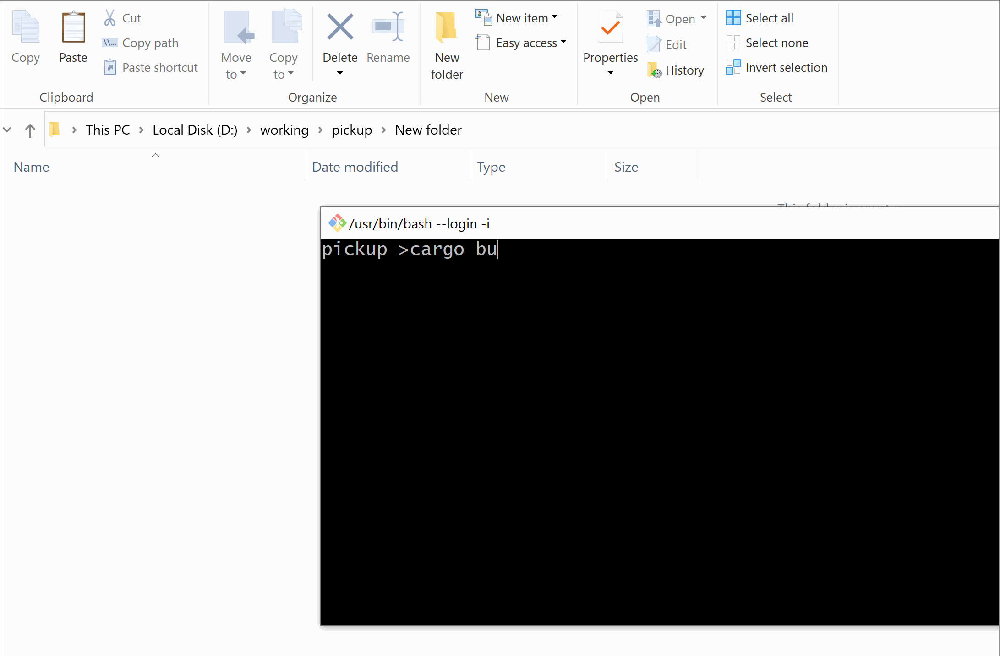

# Pickup

Copy files to clipboard from command line, expecting to achieve the same effect as right-click copy.


# How to use

## Build

Step 0: [install rust](https://rustup.rs/)

Step 1: clone & build 

```sh
git clone https://github.com/b1tg/pickup.git
cd pickup
cargo build --release
# you can find pickup.exe in ./target/release/
```

Step 2 (optional): add  `pickup.exe`  to you PATH

## Usage

```
Usage: pickup [file patterns]

Exameple: 
    # copy single file
    pickup Cargo.toml
    
    # copy all exe file in target subdirectories (need double quotation)
    pickup "target/**/*.exe"

    # copy folder
    pickup src
```




# References

- https://stackoverflow.com/q/25708895
- https://github.com/roryyorke/picellif