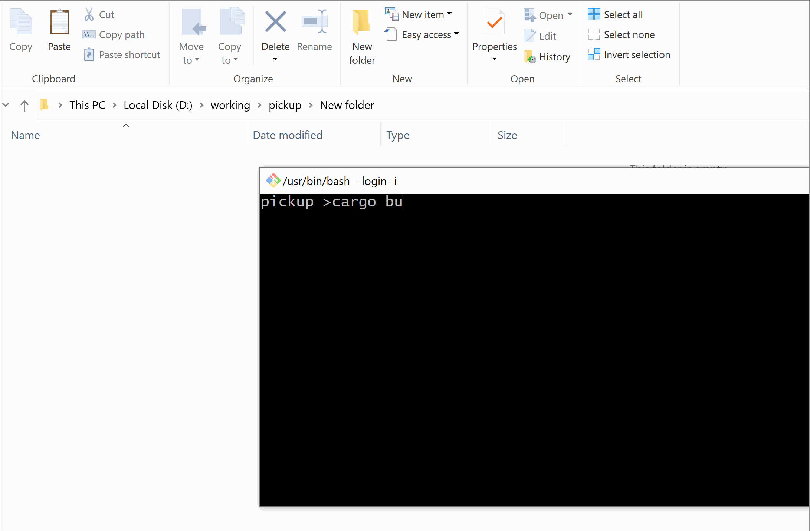

# Pickup 从命令行复制文件到剪贴板

从命令行复制文件到剪贴板，期望达到与右键复制文件相同的效果，目前支持 Windows 和 OSX 平台。


# 如何使用

## Build

第0步：[安装rust](https://rustup.rs/)

第1步：克隆和构建 

```sh
git clone https://github.com/b1tg/pickup.git
cd pickup
cargo build --release
# 你可以在 ./target/release/中找到 pickup 或 pickup.exe。
```

第2步（可选）：将 `pickup` 加入你的 PATH 中

## 使用方法

```
Usage: pickup [file patterns]

Exameple:

    #复制单个文件
    pickup Cargo.toml
    
    # 复制目标目录中的所有pdf文件（需要双引号）
    pickup "docs/**/*.pdf"

    # 复制文件夹
    pickup src
```
## 演示

### 在Windows上



### 在OSX上:


# 参考链接

- https://stackoverflow.com/q/25708895
- https://github.com/roryyorke/picellif
- https://github.com/yujinqiu/pbadd

